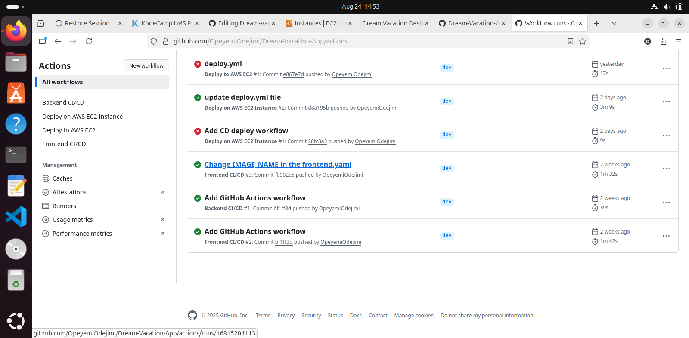

# Dream Vacation App
A full stack web app that runs on docker. The main goal of the project is to learn how to build with Docker.

## Tech Stack
* Frontend: React (served with NGINX)
* Backend: Node.js (Express)
* Database: PosgresSQL

## SetUp Instructions

1. Clone the repo:
```
git clone https://github.com/obusorezekiel/Dream-Vacation-App.git
cd Dream-Vacation-App
```
2. Create a Dockerfile in the frontend folder and backend folder. This defines how to build a docker image for the frontend and backend.
3. Create an `.env` in the root folder.
```
POSTGRES_DB="name of the db"
POSTGRES_USER=""
POSTGRES_PASSWORD="desired password"
DATABASE_URL="url that the bd runs on"
```
The  .env file is used by docker compose to manage and inject environmental variables into your services.

4. Run the app
```
docker compose up --build
```
5. Access the services via
- Frontend:localhost:3000
- Backend API:localhost:3001/api/destinations
6. Push the images to docker hub
```
docker login -u "dockerusername"
docker push "imageName"
```


# CI/CD With GitHub Actions

The purpose of this project is to help learn more on CI/CD with GitHub Actions. It uses GitHub Actions to build and automate deployment:
* The build triggers when there is a push/pull on the `dev` branch.
* It also builds Docker images for front and backend
* Pushes image to docker hub tagged with commit hash.

## Secrets 

Make sure to set the following secrets in the GitHub repo settings:
* `DOCKER_USERNAME`: your Docker hub username
* `DOCKER_TOKEN`: your DOcker hub password or token.

The following secrets will be called in your .github/workflows.

## Workflow Breakdown

1.**Frontend Workflow(.github/workflows/frontend.yaml):**
* The job is triggered on push/pull to/from dev
* Builds react frontend docker image
* Pushes the created image to docker hub and tags it with commit hash.

2.**Backend Workflow(.github/workflows/backend.yaml):**
* The job is triggered on push/pull to/from dev
* Builds react backend docker image
* Pushes the created image to docker hub and tags it with commit hash.

## Evidence that the workflow worked as expected and the docker images were built
1. 
_**Fig.

