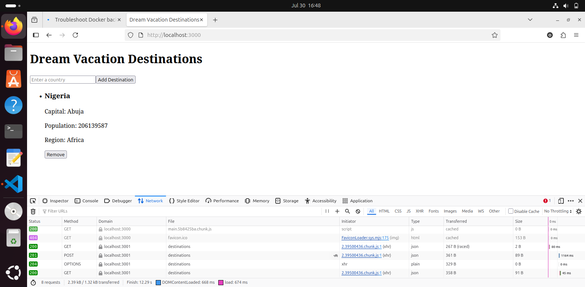
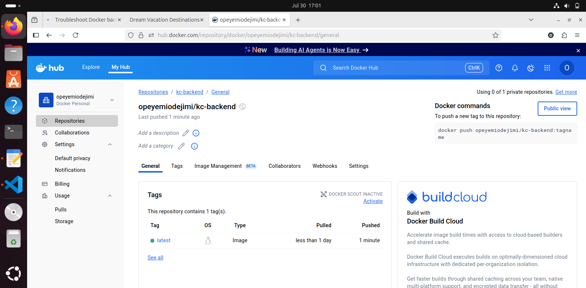

# Dream Vacation App
A full stack web app that runs on docker. The main goal of the project is to learn how to build with Docker.

## Tech Stack
* Frontend: React (served with NGINX)
* Backend: Node.js (Express)
* Database: PosgresSQL

## SetUp Instructions

1. Clone the repo:
```
git clone https://github.com/obusorezekiel/Dream-Vacation-App.git
cd Dream-Vacation-App
```
2. Create a Dockerfile in the frontend folder and backend folder. This defines how to build a docker image for the frontend and backend.
3. Create an `.env` in the root folder.
```
POSTGRES_DB="name of the db"
POSTGRES_USER=""
POSTGRES_PASSWORD="desired password"
DATABASE_URL="url that the bd runs on"
```
The  .env file is used by docker compose to manage and inject environmental variables into your services.
4. Run the app
```
docker compose up --build
```
5. Access the services via
- Frontend: [http://localhost:3000](http://localhost:3000)
- Backend API: [http://localhost:3001/api/destinations](http://localhost:3001/api/destinations)
6. Push the images to docker hub
```
docker login -u "dockerusername"
docker push "imageName"
```


## Evidence that the build was successful

1. The backend was accessed via the url provided in the step above


2. The frontend image 

3. The backend image


